## Fuel Tank Monitoring System - ICE Thermal Plants
Real-time fuel tank monitoring system for ICE thermal plants using Grafana and MQTT
## Overview
Real-time monitoring system developed for the Instituto Costarricense de Electricidad (ICE), enabling centralized visualization of critical fuel tank variables across 3 thermal plants: Barrance, Orotina, and Garabito.

Developed in collaboration with XLabs Integrations as a graduation project for Electronic Engineering - Universidad Técnica Nacional, 2024.

## Problem Statement
ICE relied on an outdated monitoring platform with no technical support or maintenance capabilities. This system replaces it with a modern, scalable , and maintainable solution.

## Technologies Used
- **Grafana** - Real-time data visualization dashboards
- **MQTT** - Lightweight messaging protocol for data communication
- **LabVIEW** - Data source system (provided by client)

##  Key Features
- Real-time monitoring of fuel level, temperature, and density.
- Simultaneous coverage of 3 thermal plants.
- Automated alert system with mobile push notifications for operational staff.
- Historical data panels for trend analysis.
- Full technical documentation for future maintence.

## System Architecture
LabVIEW (Modbus) -> MQTT Boker -> Grafana Dashboards -> Mobile Alerts

## Results
- Fully functional platform deployed across al 3 ICE thermal plants.
- Operational staff receiving real-time mobile alerts for critical tank conditions.
- System documented and maintainable by future technical personnel.

## Screenshots

### Orotina Tank
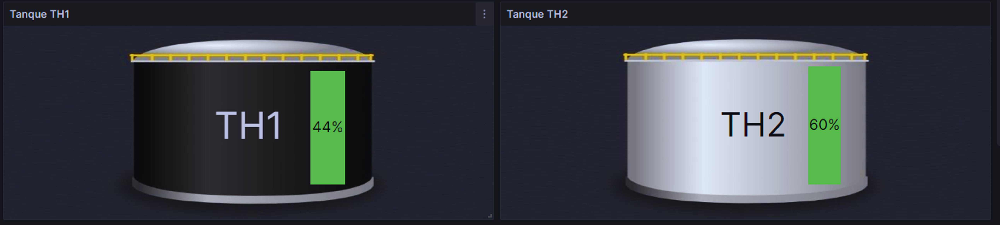

### Orotina Tank Variables
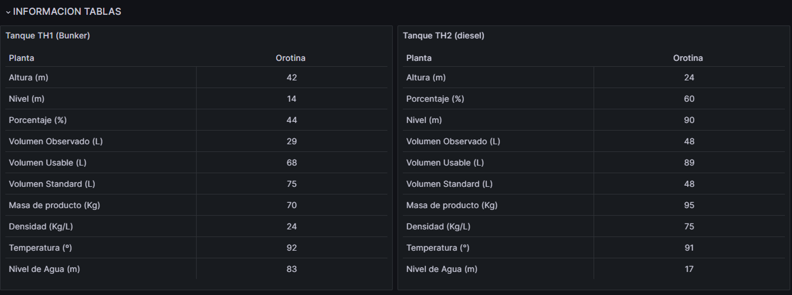

### Visualization of Orotina Tank Varibles
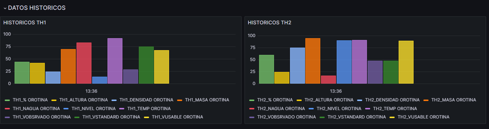

### Time Series Dashboard - Orotina Tank
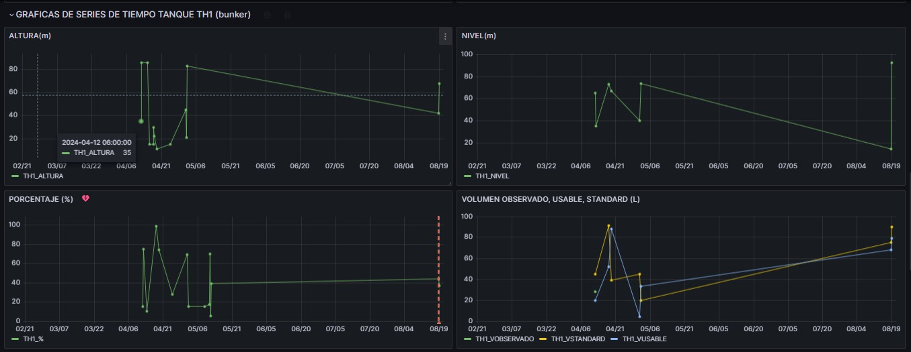

### Barranca Tank
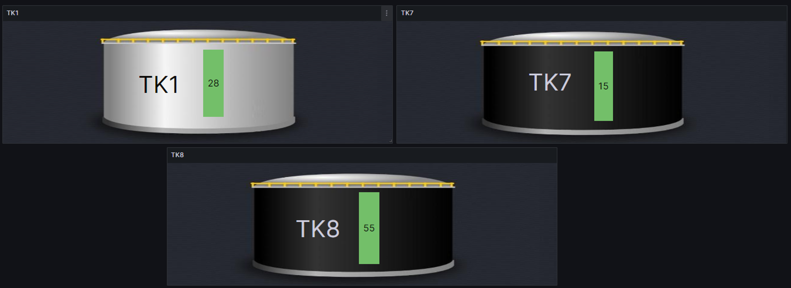

### Barranca Tank Variables
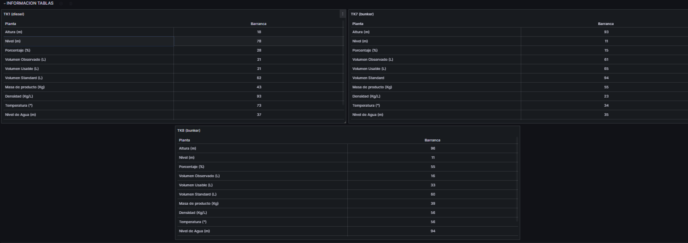

### Visualization of Barranca Tank Varibles
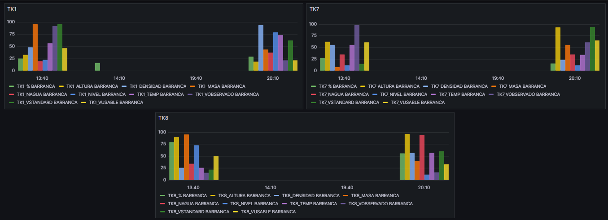

### Time Series Dashboard - Barranca Tank
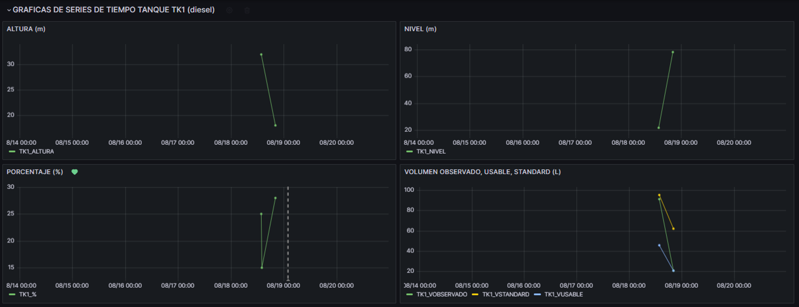

### Garabito Tank
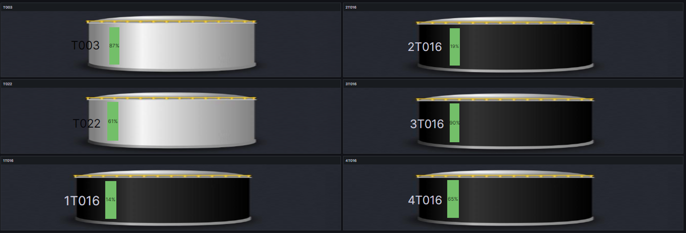

### Garabito Tank Variables
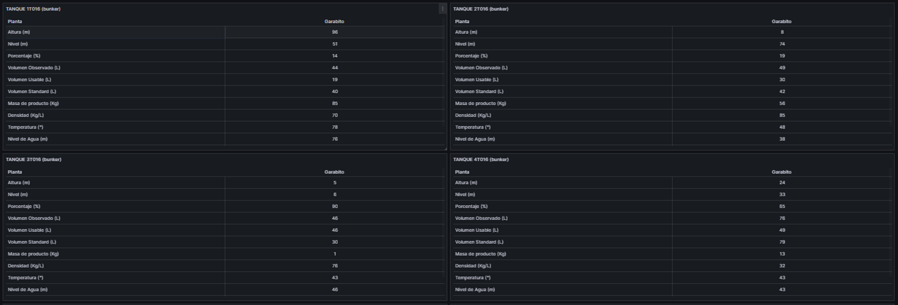

### Visualization of Garabito Tank Varibles
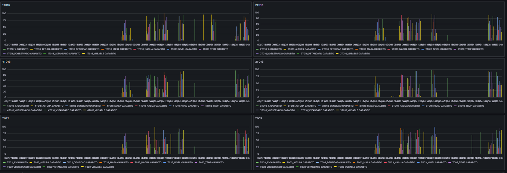

### Time Series Dashboard - Garabito Tank
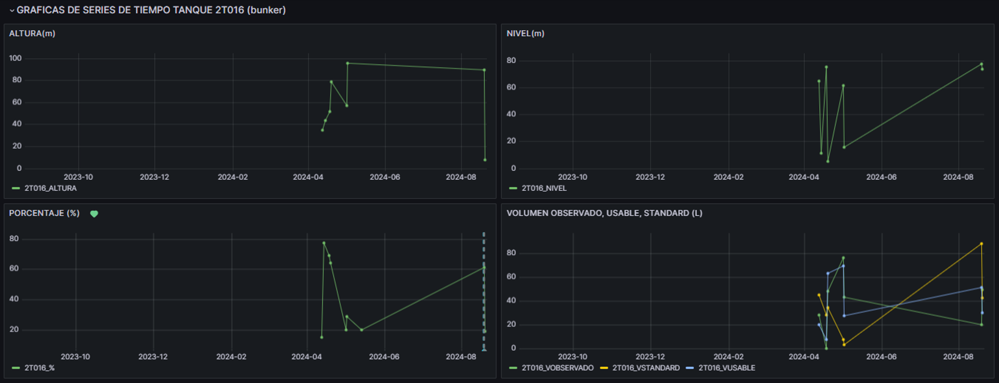

### Alerts
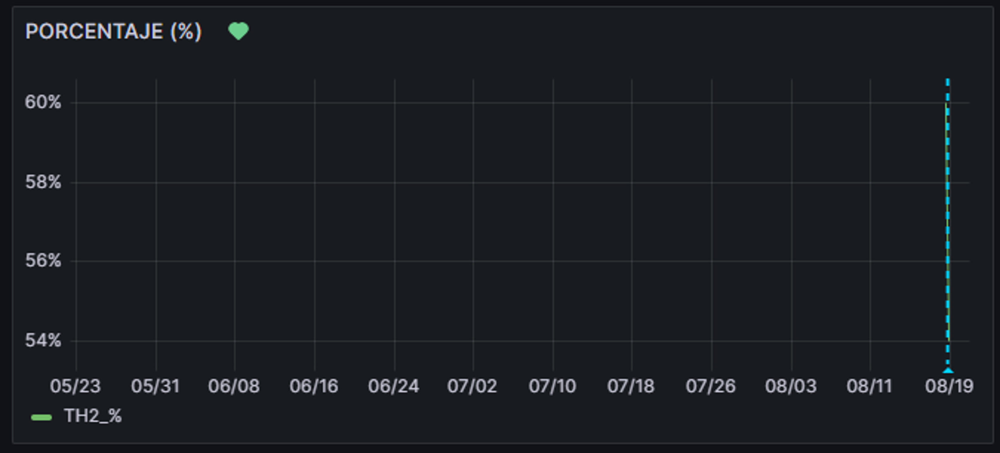

### Alert Threshold Behavior - Fuel Level Percentage
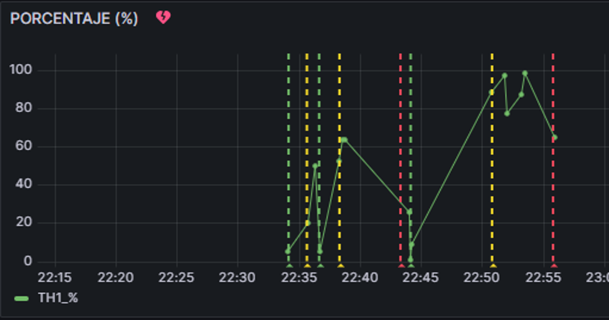

### Real-time Mobile Alert Notifications via Telegram
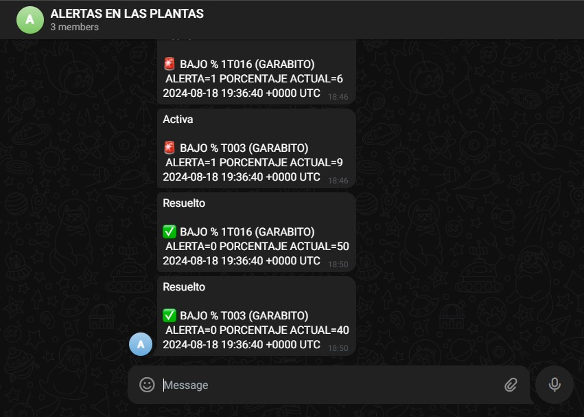
